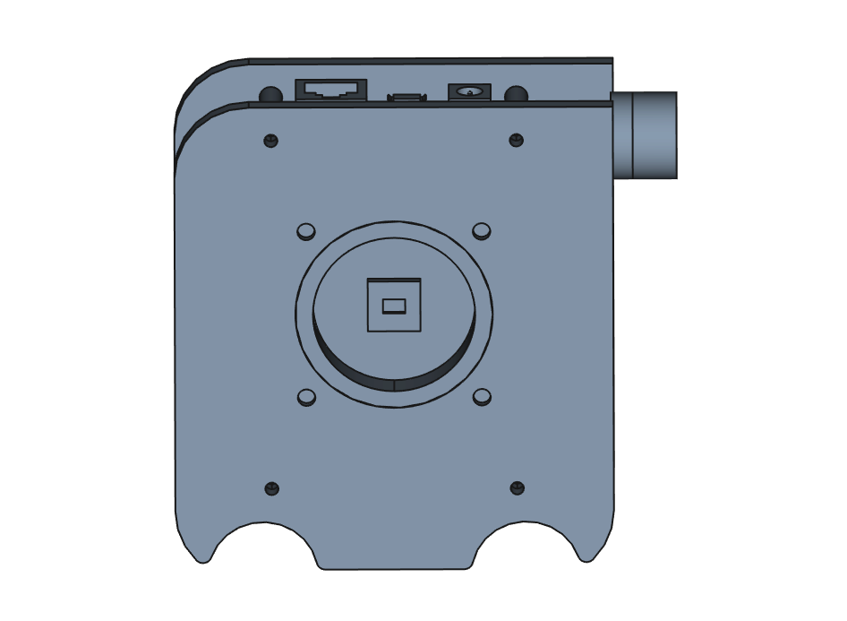

# Mechanical Design

This repository contains all the CAD work for the AXIOM micro.

The micro uses a similiar mecanical concept as the beta. An of the shelf FPGA development board is stacked
on top of custom boards. However, the AXIOM micro only uses one board to do power management, CCD interfacing and for
holding the plugin modules.

Moreover, the same lens mount mounting system as in the beta. This allows you to use the same lens mount adapter as
the beta. Details of the "AXIOM meta mount" can be found [here](https://wiki.apertus.org/index.php/File:AXIOM-Beta-Full-Enclosure-Main-for-Drawing-Drawing-1.png).
Some lens mounts need thick disks under between the axiom meta mount and the adapter to reach the correct
flange distance. 

The current enclosure design of the axiom beta is pretty open and mainly consists of cnc milled sheets of
acrylic glass for the front and back side and spacers. It allows for mounting on two 15mm rig type rails.

## Hack it!
The CAD work is done with [FreeeCAD](https://www.freecadweb.org/). Everyone is welcome to contribute to it.
Just clone the repo, and start hacking. Epecially new lens mounts can be added, so that we are able to use
all our existing glass :).

## Manufacture it!
We amufactured the case using a cnc mill for the acrylic sheets and a 3d printer for the rest.
Some parts  (especially the lens mouts) may need some manual rework after printing them.
